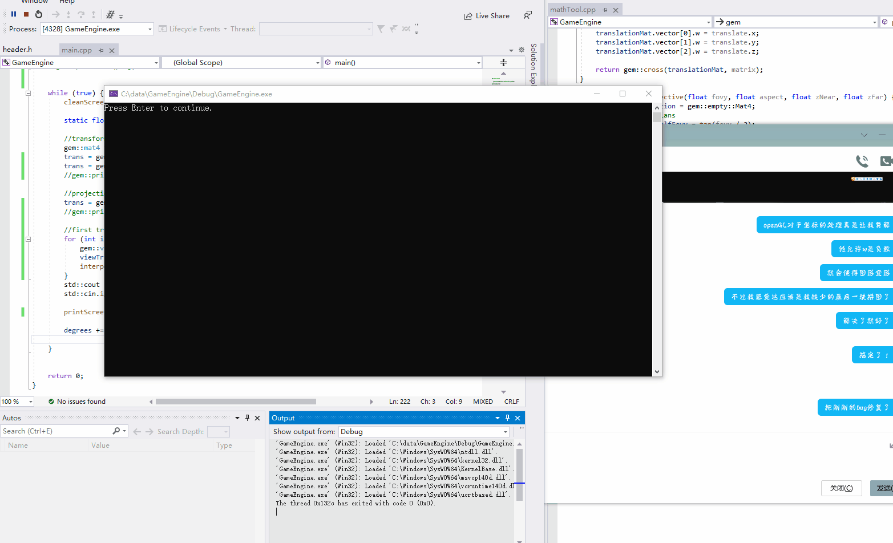

# Renderer
## dot style renderer using command prompt

### This is a dot style renderer, using the Command Prompt as the screen. The knowlegde is learned from openGL.
The basic structure and the steps of implementation is as follow:

- [x] implement interpolation
  - [x] convert between Normalized Device Coordinates and 2D array coordinates
  - [x] point-in-polygon
- [x] make a triangle and square
- [ ] EBO (optional)
- [ ] can read file (optional)
- [x] implement matrix and vector
  - [x] convert 3D model data to 4 units vector
  - [x] normalize
  - [x] matrices multiplication 4X4 * 4X4 and 4X4 * 4X1
- [x] translate, rotate
  -[x] rotate and strech a square
  -[x] convert transformed matrices to screen view, perspective projection matrix
- [x] Field of view
- [x] a cube

